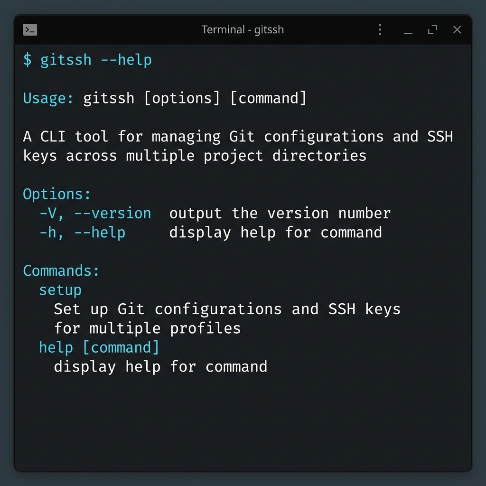
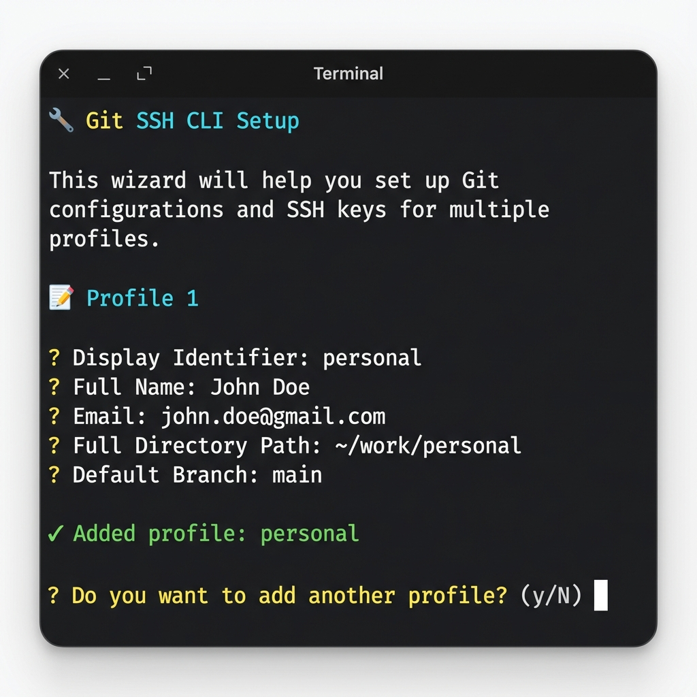
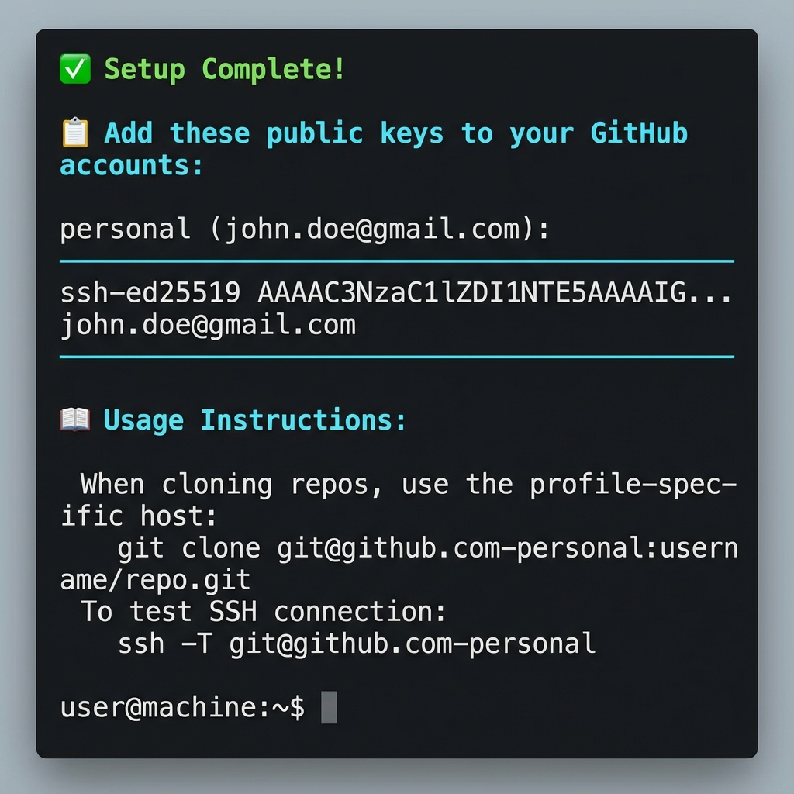

<p align="center">
  
</p>

<h1 align="center">Git SSH CLI</h1>

<p align="center">
  <strong>A cross-platform CLI tool for managing Git configurations and SSH keys across multiple project directories</strong>
</p>

<p align="center">
  <a href="#installation">Installation</a> •
  <a href="#quick-start">Quick Start</a> •
  <a href="#commands">Commands</a> •
  <a href="#how-it-works">How It Works</a> •
  <a href="#contributing">Contributing</a>
</p>

<p align="center">
  
  
  
</p>

---

## 🎯 The Problem

Managing multiple Git identities (personal, work, freelance) on the same machine is painful:
- Forgetting to change `user.email` leads to commits with the wrong identity
- Setting up SSH keys for each account is tedious and error-prone
- Remembering which SSH key to use for which repository is confusing

## ✨ The Solution

**Git SSH CLI** automates everything in one command. It:
- 🔑 Generates unique SSH keys for each identity
- 📄 Configures Git to automatically use the correct identity based on project directory
- 🔧 Sets up SSH config for seamless multi-account access

---

## 📦 Installation

### Prerequisites

- **Node.js** >= 14.0.0
- **ssh-keygen** (pre-installed on macOS, Linux, and Windows 10+)

### Install via npm

```bash
npm install -g gitsshcli
```

### Install from Source

```bash
git clone https://github.com/madhusudansinghrathore/gitsshcli.git
cd gitsshcli
npm install
npm link
```

### Verify Installation

```bash
gitssh --version
# Output: 1.0.0

gitssh --help
```

---

## 🚀 Quick Start

```bash
# Run the setup wizard
gitssh setup

# Follow the prompts to add your profiles
# That's it! Your Git and SSH configs are ready
```

---

## 📖 Commands

### `gitssh setup`

Interactive wizard to configure Git profiles and generate SSH keys.

#### What it does:

1. **Collects profile information** - Prompts for identity details
2. **Generates SSH keys** - Creates ED25519 keys for secure authentication
3. **Updates SSH config** - Adds host aliases for multi-account access
4. **Configures Git** - Sets up automatic identity switching based on directory

#### Usage:

```bash
gitssh setup
```

#### Interactive Prompts:

<p align="center">
  
</p>

The wizard prompts for:

| Prompt | Description | Example |
|--------|-------------|---------|
| **Display Identifier** | Short name for this profile (used in filenames) | `personal`, `work`, `freelance` |
| **Full Name** | Your name for Git commits | `John Doe` |
| **Email** | Email address for this identity | `john@example.com` |
| **Full Directory Path** | Root directory for projects using this identity | `~/work/personal` |
| **Default Branch** | Default branch name for new repositories | `main`, `master`, `development` |

#### Example Session:

```
🔧 Git SSH CLI Setup

This wizard will help you set up Git configurations and SSH keys for multiple profiles.

📝 Profile 1

? Display Identifier: personal
? Full Name: John Doe
? Email: john.doe@gmail.com
? Full Directory Path: ~/work/personal
? Default Branch: main

✓ Added profile: personal

? Do you want to add another profile? Yes

📝 Profile 2

? Display Identifier: work
? Full Name: John Doe
? Email: johndoe@company.com  
? Full Directory Path: ~/work/company
? Default Branch: main

✓ Added profile: work

? Do you want to add another profile? No

📋 Profiles to set up:

  1. personal
     Name: John Doe
     Email: john.doe@gmail.com
     Directory: ~/work/personal
     Branch: main

  2. work
     Name: John Doe
     Email: johndoe@company.com
     Directory: ~/work/company
     Branch: main

? Ready to set up 2 profile(s). This will generate SSH keys and update Git configs. Continue? Yes
```

#### Output:

<p align="center">
  
</p>

After successful setup:

```
🔑 Generating SSH keys...

  Generating key for personal...
  ✓ Generated: ~/.ssh/personal
  Generating key for work...
  ✓ Generated: ~/.ssh/work

📄 Updating SSH config...

  ✓ Updated ~/.ssh/config

📄 Updating Git config...

  ✓ Updated ~/.gitconfig with includeIf blocks

📄 Creating profile Git configs...

  ✓ Created ~/.gitconfig-personal
  ✓ Created ~/.gitconfig-work

✅ Setup Complete!

📋 Add these public keys to your GitHub accounts:

personal (john.doe@gmail.com):
────────────────────────────────────────────────────────────
ssh-ed25519 AAAAC3NzaC1lZDI1NTE5AAAAI... john.doe@gmail.com
────────────────────────────────────────────────────────────

work (johndoe@company.com):
────────────────────────────────────────────────────────────
ssh-ed25519 AAAAC3NzaC1lZDI1NTE5AAAAI... johndoe@company.com
────────────────────────────────────────────────────────────

📖 Usage Instructions:

  When cloning repos, use the profile-specific host:
    git clone git@github.com-personal:username/repo.git
    git clone git@github.com-work:username/repo.git

  To test SSH connection:
    ssh -T git@github.com-personal
    ssh -T git@github.com-work
```

---

## 📁 Generated Files

After running `gitssh setup`, the following files are created/updated:

### SSH Keys

| File | Description |
|------|-------------|
| `~/.ssh/<identifier>` | Private SSH key (keep secret!) |
| `~/.ssh/<identifier>.pub` | Public SSH key (add to GitHub) |

### SSH Config (`~/.ssh/config`)

```bash
# personal GitHub account
Host github.com-personal
    HostName github.com
    User git
    IdentityFile ~/.ssh/personal
    IdentitiesOnly yes

# work GitHub account  
Host github.com-work
    HostName github.com
    User git
    IdentityFile ~/.ssh/work
    IdentitiesOnly yes
```

### Git Config (`~/.gitconfig`)

```ini
[includeIf "gitdir:~/work/personal/"]
    path = ~/.gitconfig-personal

[includeIf "gitdir:~/work/company/"]
    path = ~/.gitconfig-work
```

### Profile Git Configs

**`~/.gitconfig-personal`:**
```ini
[user]
    name = John Doe
    email = john.doe@gmail.com

[init]
    defaultBranch = main
```

**`~/.gitconfig-work`:**
```ini
[user]
    name = John Doe
    email = johndoe@company.com

[init]
    defaultBranch = main
```

---

## 🔧 How It Works

### Automatic Identity Switching

Git's `includeIf` directive automatically loads different configurations based on the repository's location:

```
~/work/
├── personal/          ← Uses ~/.gitconfig-personal
│   ├── my-blog/
│   └── side-project/
└── company/           ← Uses ~/.gitconfig-work
    ├── main-app/
    └── internal-tool/
```

### SSH Host Aliases

Instead of using `github.com` directly, use profile-specific hosts:

```bash
# Instead of:
git clone git@github.com:username/repo.git

# Use:
git clone git@github.com-personal:username/repo.git
# or
git clone git@github.com-work:username/repo.git
```

This tells SSH which key to use for authentication.

---

## 📝 Post-Setup Steps

### 1. Add SSH Keys to GitHub

For each profile, add the public key to the corresponding GitHub account:

1. Copy the public key from the setup output (or run `cat ~/.ssh/<identifier>.pub`)
2. Go to GitHub → **Settings** → **SSH and GPG keys**
3. Click **New SSH key**
4. Paste the key and save

### 2. Test SSH Connections

```bash
ssh -T git@github.com-personal
# Hi username! You've successfully authenticated...

ssh -T git@github.com-work
# Hi username! You've successfully authenticated...
```

### 3. Clone Repositories

Use the profile-specific host when cloning:

```bash
# Personal projects
cd ~/work/personal
git clone git@github.com-personal:myusername/my-repo.git

# Work projects
cd ~/work/company
git clone git@github.com-work:company/project.git
```

### 4. Update Existing Repositories

For existing repos, update the remote URL:

```bash
cd ~/work/personal/existing-repo
git remote set-url origin git@github.com-personal:username/repo.git
```

---

## ❓ FAQ

### Can I add more profiles later?

Yes! Just run `gitssh setup` again. New profiles will be appended to existing configurations.

### What if I already have SSH keys?

If a key with the same name exists, the tool will skip generation and reuse the existing key.

### Does this work with GitLab/Bitbucket?

Currently configured for GitHub, but you can manually edit `~/.ssh/config` to add other providers:

```bash
Host gitlab.com-personal
    HostName gitlab.com
    User git
    IdentityFile ~/.ssh/personal
    IdentitiesOnly yes
```

### How do I remove a profile?

Manually remove the relevant sections from:
- `~/.ssh/config`
- `~/.gitconfig`
- Delete `~/.gitconfig-<identifier>`
- Optionally delete `~/.ssh/<identifier>` and `~/.ssh/<identifier>.pub`

---

## 🛠️ Development

```bash
# Clone the repository
git clone https://github.com/madhusudansinghrathore/gitsshcli.git
cd gitsshcli

# Install dependencies
npm install

# Link for local development
npm link

# Run the CLI
gitssh --help
```

---

## 🤝 Contributing

Contributions are welcome! Please feel free to submit a Pull Request.

1. Fork the repository
2. Create your feature branch (`git checkout -b feature/AmazingFeature`)
3. Commit your changes (`git commit -m 'Add some AmazingFeature'`)
4. Push to the branch (`git push origin feature/AmazingFeature`)
5. Open a Pull Request

---

## 📄 License

This project is licensed under the MIT License - see the [LICENSE](LICENSE) file for details.

---

## ⭐ Show Your Support

If this project helped you, please give it a ⭐ on GitHub!

---

<p align="center">
  Made with ❤️ for developers juggling multiple Git identities
</p>
